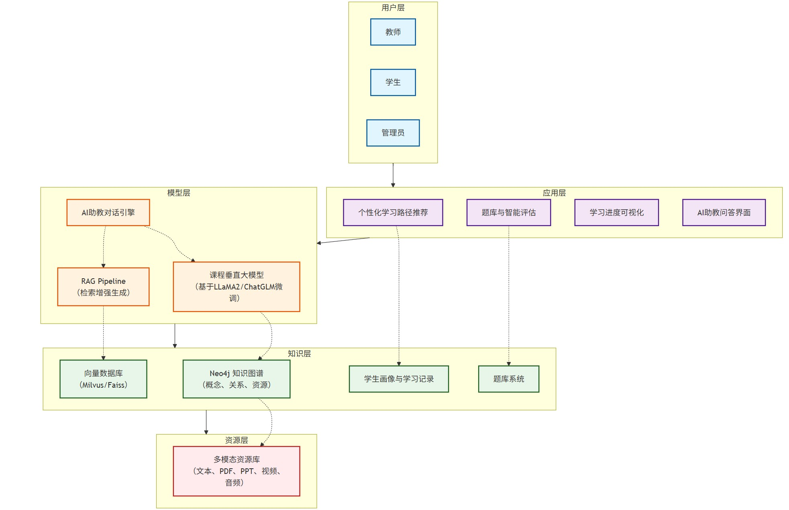

# AI 辅助的学习系统

一门课程的 AI 辅助的个性化学习系统功能要求:

1. 教师可以上传各种多模态的资源到知识库
2. 知识库应该基于知识图谱构建，基于图数据库，比如 Neo4j
3. 系统基于知识库微调大模型生成本课程的垂直大模型（SFT）
4. 当学习者进行输入，提出问题时，使用 RAG 技术对输入进行增强然后再交给微调的垂直模型，产生输出，返回给学习者
5. 基于知识图谱构建每位同学的个性化的学习路径，并且个性化的推荐学习资源
6. 构建基于知识图谱的题库，题目评估学习者各个知识点的掌握情况，针对短板提供学习资源建议
7. 以知识图谱形式展示学习者的学习完成的节点以及完成的质量
8. 系统支持多种角色，教师，学习者，管理员
9. AI 助教基于微调的垂直模型回答问题

## 功能特点

### 一、知识资源管理模块

**任务要求**：

1. 教师可以上传多模态资源（文本、PPT、PDF、视频、音频、图片等）。
2. 系统需要将资源进行结构化存储与解析，提取元数据（标题、作者、关键字、课程章节）。
3. 资源入库时，需要和知识图谱中的节点/关系自动关联。

**学生需要完成的工作**：

- 资源上传接口（前端/后端 API）。
- 资源解析和特征抽取（NLP、OCR、视频字幕提取）。
- 知识图谱节点自动更新。

### 二、知识图谱构建与管理

**任务要求**：

1. 使用 Neo4j 或类似的图数据库构建课程知识图谱。
2. 知识图谱包含：概念节点、知识点之间的关系（依赖、包含、对比）、资源节点（文件、视频、实验案例）、学生学习记录节点。
3. 支持图谱的可视化展示。

**学生需要完成的工作**：

- 课程知识点的抽取与结构化。
- Neo4j 数据建模（节点类型、关系类型）。
- 图谱数据的查询与可视化接口。

### 三、课程垂直大模型构建

**任务要求**：

1. 选取一个开源大模型（如 LLaMA2、Bloom、ChatGLM 等）。
2. 基于课程知识库进行微调（LoRA、PEFT 等轻量化微调方法）。
3. 部署成课程的垂直领域模型。

**学生需要完成的工作**：

- 知识库数据清洗与格式化。
- 微调训练流程的搭建。
- 模型推理 API 接口开发。

### 四、RAG 技术集成

**任务要求**：

1. 当学生提出问题时，系统需先检索知识库（向量数据库/知识图谱）。
2. 将检索结果与学生输入结合，增强输入。
3. 把增强后的输入交给微调后的垂直大模型，生成答案。

**学生需要完成的工作**：

- 向量数据库（如 Milvus、Pinecone、Faiss）构建。
- RAG pipeline 搭建。
- 问答服务接口。

### 五、个性化学习路径推荐

**任务要求**：

1. 基于知识图谱构建学生个性化学习路径（节点关系 + 学生学习情况）。
2. 根据学生掌握情况，推荐学习资源（文章、视频、练习题）。
3. 支持动态调整学习路径。

**学生需要完成的工作**：

- 学习路径推荐算法设计（基于图算法，如最短路径、中心度、个性化 PageRank）。
- 资源推荐逻辑实现。
- 可视化学习路径图。

### 六、基于知识图谱的题库与评估

**任务要求**：

1. 构建一个与知识点绑定的题库。
2. 学生答题时，系统根据答题情况更新图谱中的“掌握度”权重。
3. 对短板知识点给出个性化学习资源推荐。

**学生需要完成的工作**：

- 题库数据设计（选择题、填空题、编程题）。
- 学习者知识点掌握度计算（基于答题正确率、答题时间）。
- 针对短板的智能推荐算法。

### 七、学习过程可视化

**任务要求**：

1. 以知识图谱形式展示学生学习进度。
2. 不同节点标注完成情况（已学、未学、掌握度百分比）。
3. 支持学习质量指标展示（学习时长、答题正确率、完成度）。

**学生需要完成的工作**：

- 学习者节点可视化。
- 进度与掌握度可视化（图表 + 图谱结合）。
- 进度追踪 API。

### 八、多角色支持

**任务要求**：

1. 教师：资源上传、题库维护、布置任务、查看学生学习情况。
2. 学生：学习资源访问、答题、学习路径浏览、提问互动。
3. 管理员：系统维护、用户管理、数据管理。

**学生需要完成的工作**：

- 不同角色的权限管理（RBAC）。
- 不同角色的前端界面与交互设计。

### 九、AI 助教

**任务要求**：

1. AI 助教基于微调后的课程模型。
2. 学生可向 AI 助教提问，获取专业、个性化的回答。
3. AI 助教能结合学生画像与知识图谱，提供针对性的解答和学习建议。

**学生需要完成的工作**：

- AI 助教对话系统开发。
- 学生画像构建与动态更新。
- 个性化回答优化（结合知识图谱与 RAG）。

## 设计架构

- 资源层（教师上传多模态资源 → 知识图谱/向量库）
- 知识层（Neo4j 知识图谱、题库、学生画像）
- 模型层（课程垂直大模型、RAG pipeline、AI 助教）
- 应用层（学习路径推荐、题库评估、学习进度可视化）
- 用户层（教师、学生、管理员）

## 人员分工

| 姓名                                    | 负责功能                                                                  |
| :-------------------------------------- | :------------------------------------------------------------------------ |
| [郭彦晨](https://github.com/guoyc666)   | 知识资源管理模块-资源解析，课程垂直大模型构建，RAG 技术集成，AI 助教      |
| [张诏](https://github.com/xinmserius)   | 知识资源管理模块-知识图谱节点自动更新，知识图谱构建与管理，学习过程可视化 |
| [冯轶开](https://github.com/calvinfkkk) | 知识资源管理模块-资源上传接口前端，多角色支持，基于知识图谱的题库与评估   |
| [龙功泽](https://github.com/Ekazawa)    | 知识资源管理模块-资源上传接口后端，个性化学习路径推荐                     |

---

[@BIT](https://www.bit.edu.cn) 2025年秋
