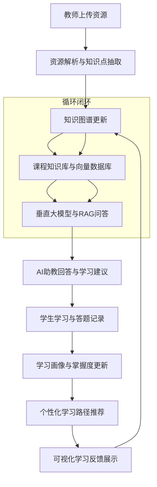
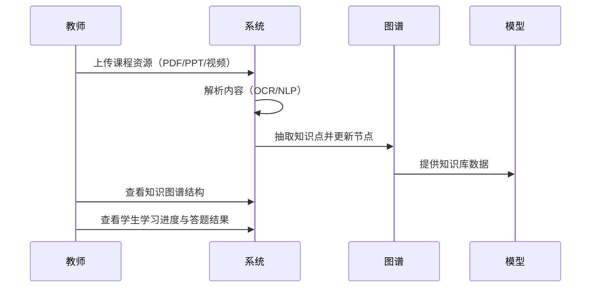
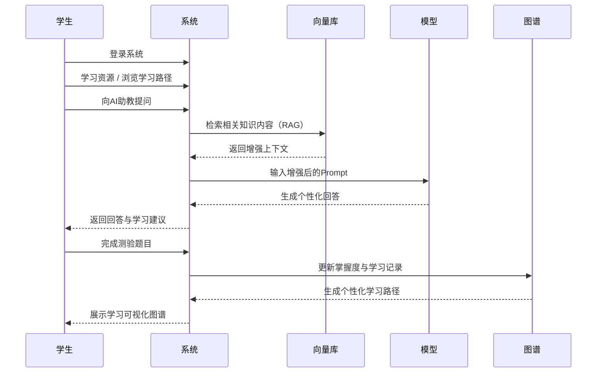
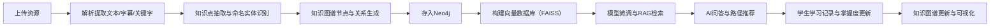
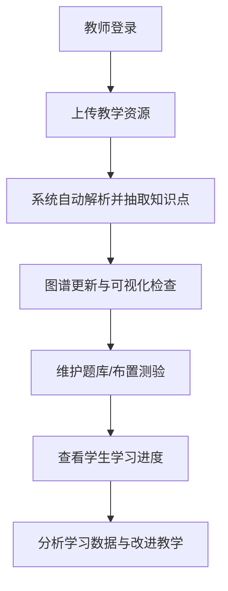
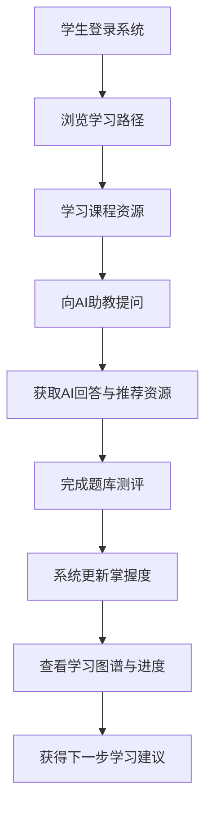

# AI 辅助的个性化学习系统 — 概要设计说明书

## 一、设计目标

本系统旨在构建一个结合 **知识图谱（Knowledge Graph）**、**大语言模型（LLM）** 与 **RAG（检索增强生成）** 技术的智能学习平台。  
系统通过自动解析教学资源、构建知识图谱、个性化学习路径推荐与智能问答，实现从“资源 → 知识 → 学习 → 反馈”的完整闭环。

系统支持三类用户：

- **教师**：上传课程资源、维护知识结构、查看学生学习状态；
- **学生**：学习课程内容、提问 AI 助教、参与测评并获得个性化推荐；
- **管理员**：维护系统数据与用户权限。

---

## 二、系统总体结构

系统整体采用 **分层架构设计**，以“知识驱动 + 模型增强”为核心逻辑。



该系统形成一个持续更新的**学习反馈闭环**：  
资源输入 → 知识结构化 → 模型生成 → 学习反馈 → 图谱更新。

---

## 三、系统主要功能流程说明

### 3.1 教师与系统的交互流程



---

### 3.2 学生与系统的学习活动流程



---

## 四、系统核心逻辑流与数据流



---

## 五、系统逻辑视图

```mermaid
graph LR
    subgraph 用户层
        T[教师端]
        S[学生端]
        M[管理员]
    end

    subgraph 应用服务层
        R[资源管理服务]
        L[学习推荐服务]
        Q[智能问答服务]
        E[评估与可视化服务]
        A[权限与账户服务]
    end

    subgraph 知识与模型层
        KG[知识图谱 (Neo4j)]
        VDB[向量数据库 (FAISS)]
        LLM[垂直领域大模型 (LoRA/ChatGLM)]
    end

    subgraph 数据层
        RES[多模态资源库]
        DB[用户与题库数据库]
    end

    T --> R
    S --> Q
    S --> L
    S --> E
    R --> KG
    L --> KG
    Q --> VDB
    Q --> LLM
    KG --> L
    E --> KG
    DB --> E
    DB --> L
```

---

## 六、主要活动图

### 教师活动图



### 学生活动图



---

## 七、系统特性与总结

- 知识驱动：以知识图谱为核心结构；
- 智能增强：基于 RAG + 大模型实现智能问答；
- 个性化推荐：结合学习路径与掌握度；
- 多模态支持：文本、视频、PPT；
- 可视化交互：学习图谱与进度展示；
- 可扩展架构：适合课程项目与后续优化。

---
