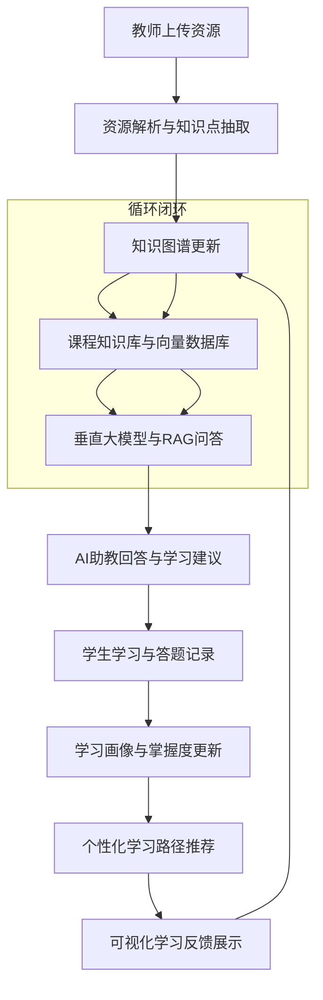
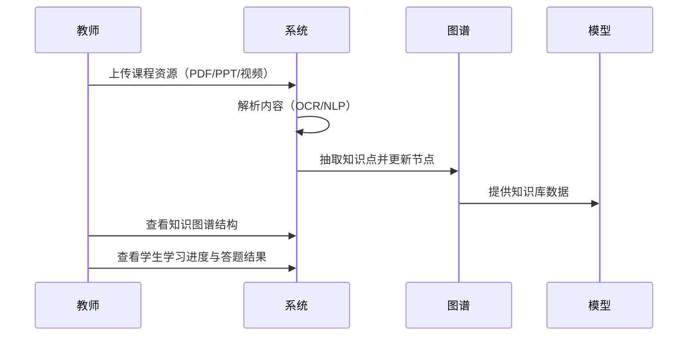
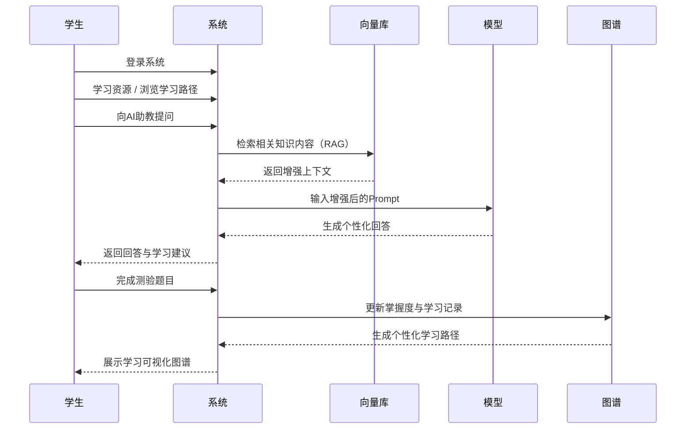
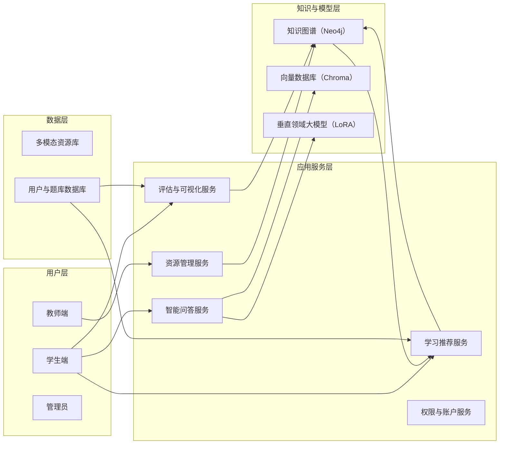
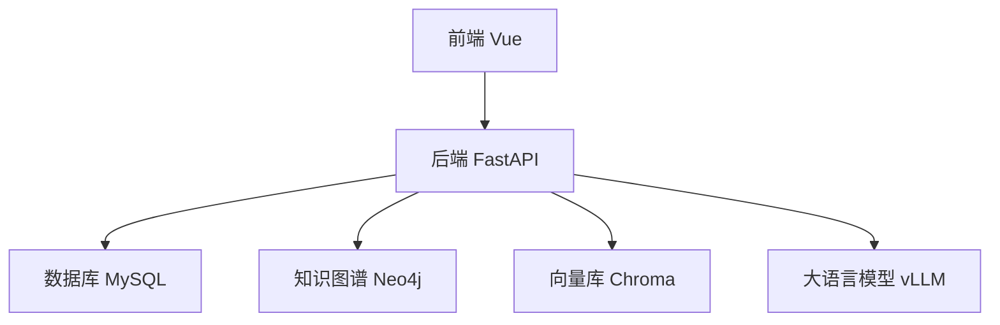

# 概要设计说明书

## 1. 引言

### 1.1 编写目的

本概要设计说明书旨在对“AI 辅助的个性化学习系统”进行总体设计描述，指导后续详细设计与编码活动，并为需求方、开发方、测试方提供统一的设计依据。

### 1.2 背景

a. 系统名称：AI 辅助的个性化学习系统（AI-COURSE）  
b. 参与方：

- 任务提出者：课程教师 / 项目指导老师
- 开发者：软件工程课程项目团队（4 名本科生）
- 最终用户：教师、学生、管理员

### 1.3 定义

- **RAG**：Retrieval-Augmented Generation，检索增强生成
- **知识图谱（KG）**：用于组织课程知识点的图结构
- **向量库**：用于语义检索的向量数据库

### 1.4 参考资料

- [需求规格说明书（SRS）](需求规格说明书.md)
- [Neo4j 图数据库官方文档](https://neo4j.ac.cn/docs/)
- [ChromaDB 官方文档](https://docs.trychroma.com/docs/overview/introduction)

## 2. 总体设计

### 2.1 需求规定

#### 2.1.1 系统功能

系统主要功能包括：

1. 教师上传课程资源并自动解析知识点
2. 构建课程知识图谱
3. 学生进行 AI（RAG）问答
4. 题库管理与练习
5. 学习路径推荐
6. 学生掌握度可视化
7. 系统后台管理（用户、配置、备份）

#### 2.1.2 系统性能

精度

- 语义检索 Top-5 相似度召回 > 80%
- AI 问答正确率依赖课程内容大模型，要求具备基本解释能力

时间特性要求

- RAG 检索延迟 < 1.5s （GPU 环境）
- 页面加载时间 < 2s
- 资源解析时间依据文件大小，需提示用户进度

可靠性

- 发现文件解析失败时自动提示
- 系统应能在网络波动下自动重试 API 请求
- 对用户敏感操作（删除题目、节点）提供二次确认

灵活性

- 知识图谱可手动编辑
- 向量库可重新构建
- 可扩展新题型、新资源类型

#### 2.1.3 输入输出要求

**输入：**

- PDF、PPT、视频文件
- 学生提问文本
- 教师添加题目
- 用户认证信息

**输出：**

- AI 问答
- 学习路径
- 知识图谱可视化
- 题库与练习结果
- 学生学习报告

#### 2.1.4 数据管理能力要求

- MySQL 维护结构化数据
- Neo4j 维护知识图谱数据
- ChromaDB 存储语义向量
- 数据支持增删改查操作

#### 2.1.5 故障处理要求

- 文件解析失败 → 提示重新上传
- AI 模型调用失败 → 使用备选回答模板
- 图谱构建错误 → 可单独解析资源

#### 2.1.6 其他专门要求

- 多角色权限（学生/教师/管理员）
- 支持 HTTPS 部署
- 具备日志记录功能

### 2.2 运行环境

#### 2.2.1 设备

- 开发环境：普通 PC（16GB RAM）
- 模型环境：GPU（NVIDIA 2080Ti / T4 以上）

#### 2.2.2 支持软件

- Python 3.10
- Node
- FastAPI
- Vue3
- MySQL
- Neo4j
- ChromaDB

#### 2.2.3 接口

- RESTful API
- Web 界面
- 数据导入/导出（JSON）

#### 2.2.4 控制

- 系统支持基于 JWT 的访问控制
- 严格区分前后端权限接口控制

### 2.3 基本设计概念和处理流程

系统整体采用 **分层架构设计**，以“知识驱动 + 模型增强”为核心逻辑。

该系统形成一个持续更新的**学习反馈闭环**：  
资源输入 → 知识结构化 → 模型生成 → 学习反馈 → 图谱更新。

**教师与系统的交互流程**

**学生与系统的学习活动流程**

**系统逻辑视图**

### 2.4 结构

#### 系统结构框图（软件）

模块划分：

1. 用户模块
2. 资源管理模块
3. 图谱管理模块
4. AI 问答模块
5. 学习分析模块
6. 题库模块
7. 管理后台模块

### 2.5 功能需求与系统模块的关系

| 功能需求 | 用户模块 | 图谱模块 | RAG 模块 | 题库模块 | 管理模块 |
| -------- | -------- | -------- | -------- | -------- | -------- |
| 用户认证 | √        |          |          |          | √        |
| 资源上传 |          | √        |          |          |          |
| 图谱展示 |          | √        |          |          |          |
| AI 问答  |          | √        | √        |          |          |
| 学习记录 | √        | √        |          | √        |          |
| 题目练习 |          |          |          | √        |          |
| 系统配置 |          |          |          |          | √        |

### 2.6 人工处理过程

- 教师手动纠正错误的知识点
- 教师确认题目的标准答案
- 管理员维护用户与权限

## 3. 接口设计

### 3.1 用户接口

- Web 图形界面（基于 Vue）
- 功能菜单：资源、图谱、AI、题库、学习路径

### 3.2 外部接口

- 文件上传接口
- WebSocket（可选，用于实时消息）
- 数据导出接口（JSON/CSV）

### 3.3 内部接口

- 后端内部服务调用（图谱、向量库、模型）
- Micro API（图谱节点查询、RAG 搜索）

## 4. 运行设计

### 4.1 运行模块组合

运行时模块包含：

- 用户认证模块
- 图谱模块
- 资源解析模块
- RAG 问答模块
- 学习分析模块

### 4.2 运行控制

- 用户登录控制
- 后端统一路由管理
- 异常捕获中间件

### 4.3 运行时间

- 后端服务持续运行
- 模型首次加载：5–30 秒

## 5. 系统数据结构设计

### 5.1 逻辑结构设计要点

主要数据结构：

- User
- Resource
- Knowledge
- Question
- LearningRecord

（对应字段见详细设计）

### 5.2 物理结构设计要点

- MySQL 表以 InnoDB 存储
- Neo4j 以节点与关系形式存储
- FAISS 向量库使用 Flat 或 HNSW

### 5.3 数据结构与程序的关系

| 数据结构       | 用户模块 | 图谱模块 | RAG 模块 | 题库模块 |
| -------------- | -------- | -------- | -------- | -------- |
| User           | √        |          |          |          |
| Resource       | √        | √        |          |          |
| Knowledge      |          | √        | √        |          |
| Question       |          |          |          | √        |
| LearningRecord | √        | √        | √        | √        |

---

## 6. 系统出错处理设计

### 6.1 出错信息

| 出错情况     | 输出信息        | 处理方法             |
| ------------ | --------------- | -------------------- |
| 文件解析失败 | “解析失败”      | 提示重新上传         |
| 模型推理失败 | “AI 暂时不可用” | 重试或退回预定义回答 |
| 图谱加载失败 | “图谱不可用”    | 重启图谱服务         |

---

### 6.2 补救措施

**后备技术**

- 定期备份数据库与向量库

**降效技术**

- AI 模型不可用 → 使用知识库检索回答

**恢复与再启动技术**

- 服务异常自动重启（systemd）
- 图谱损坏可使用备份恢复

## 6.3 系统维护设计

- 提供统一日志记录
- 自动健康检查
- 单独的管理界面
- 明确模块划分，便于替换与维护
