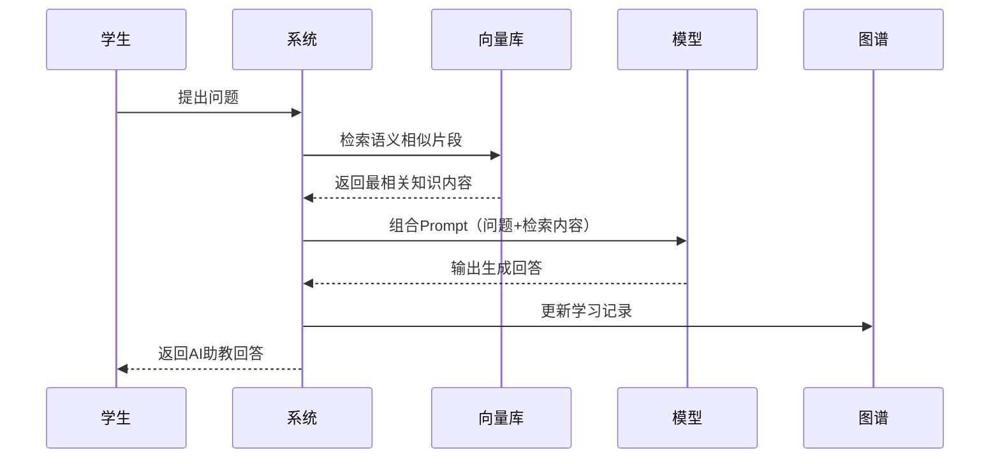
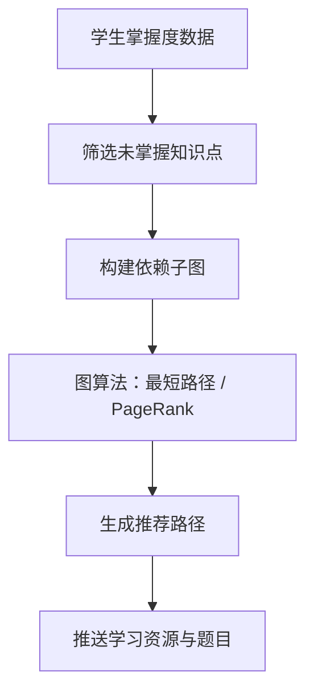
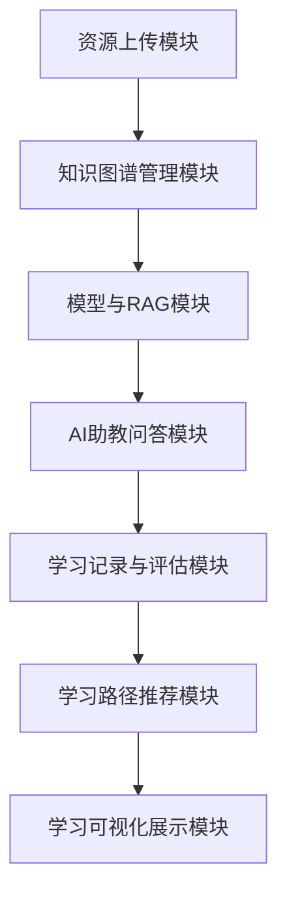
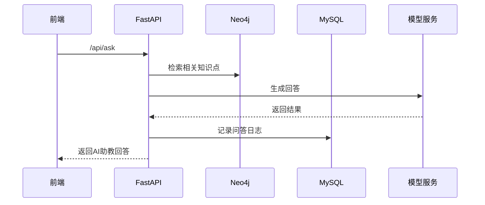

# AI 辅助的个性化学习系统 — 详细设计说明书

## 一、文档目的

本详细设计说明书在概要设计的基础上，进一步说明系统的数据结构、主要接口、算法逻辑与模块间数据交互方式。  
文档的目标是指导系统的具体实现，使开发人员能够据此完成系统编码与调试。

---

## 二、系统总体设计回顾

系统结构包括：

- **用户层**：教师、学生、管理员；
- **应用层**：资源管理、问答、推荐、评估；
- **知识与模型层**：知识图谱（Neo4j）、RAG 管线、垂直领域大模型；
- **数据层**：MySQL 数据库、FAISS 向量库、多模态资源文件库。

---

## 三、数据库设计

系统数据库采用 **MySQL**（结构化信息）与 **Neo4j**（知识图谱）结合的方式。  
MySQL 用于存储用户、题库、学习记录等结构化数据；Neo4j 用于管理课程知识点及其语义关系。

---

### 3.1 关系数据库（MySQL）设计

#### （1）用户表 `user`

| 字段名     | 类型                              | 说明         |
| ---------- | --------------------------------- | ------------ |
| id         | INT                               | 主键，自增   |
| username   | VARCHAR(50)                       | 用户名       |
| password   | VARCHAR(100)                      | 哈希后的密码 |
| role       | ENUM('student','teacher','admin') | 用户角色     |
| email      | VARCHAR(100)                      | 邮箱（可选） |
| created_at | DATETIME                          | 创建时间     |

---

#### （2）课程资源表 `resource`

| 字段名      | 类型                             | 说明           |
| ----------- | -------------------------------- | -------------- |
| id          | INT                              | 主键           |
| title       | VARCHAR(200)                     | 资源标题       |
| type        | ENUM('pdf','ppt','video','text') | 资源类型       |
| path        | VARCHAR(255)                     | 文件路径       |
| keywords    | TEXT                             | 自动提取关键词 |
| uploader_id | INT                              | 上传教师 ID    |
| upload_time | DATETIME                         | 上传时间       |

---

#### （3）题库表 `question`

| 字段名       | 类型                          | 说明                           |
| ------------ | ----------------------------- | ------------------------------ |
| id           | INT                           | 主键                           |
| text         | TEXT                          | 题目内容                       |
| type         | ENUM('choice','fill','short') | 题目类型                       |
| options      | TEXT                          | 选项（JSON 格式）              |
| answer       | TEXT                          | 正确答案                       |
| knowledge_id | VARCHAR(100)                  | 对应知识点 ID（Neo4j 节点 ID） |
| difficulty   | FLOAT                         | 难度系数                       |

---

#### （4）学生学习记录表 `learning_record`

| 字段名       | 类型         | 说明          |
| ------------ | ------------ | ------------- |
| id           | INT          | 主键          |
| student_id   | INT          | 学生 ID       |
| knowledge_id | VARCHAR(100) | 知识点节点 ID |
| progress     | FLOAT        | 完成度（0~1） |
| score        | FLOAT        | 平均答题得分  |
| last_access  | DATETIME     | 最近学习时间  |

---

#### （5）问答记录表 `qa_log`

| 字段名            | 类型     | 说明           |
| ----------------- | -------- | -------------- |
| id                | INT      | 主键           |
| student_id        | INT      | 提问者 ID      |
| question          | TEXT     | 学生提问内容   |
| answer            | TEXT     | 模型生成的回答 |
| related_knowledge | TEXT     | 检索到的知识点 |
| timestamp         | DATETIME | 提问时间       |

---

### 3.2 知识图谱（Neo4j）结构设计

**节点类型：**

| 类型     | 属性             | 示例               |
| -------- | ---------------- | ------------------ |
| Concept  | name, desc       | “梯度下降法”       |
| Resource | title, type      | “优化算法讲义.pdf” |
| Question | text, difficulty | “解释梯度下降原理” |
| Student  | name, id         | “张三, s001”       |

**关系类型：**

| 关系类型     | 含义             | 示例                     |
| ------------ | ---------------- | ------------------------ |
| contains     | 上下层知识结构   | “机器学习” → “监督学习”  |
| depends_on   | 前置依赖         | “梯度下降” → “偏导数”    |
| has_resource | 知识点相关资源   | “线性回归” → “讲义.pdf”  |
| tested_by    | 知识点被题目考察 | “逻辑回归” → “选择题 Q1” |
| mastered_by  | 学生掌握知识点   | “梯度下降” → “张三”      |

---

## 四、主要接口设计

系统接口采用 **RESTful API** 风格，后端基于 **FastAPI** 实现。

### 4.1 用户与认证接口

| 接口             | 方法 | 描述                 | 参数                     |
| ---------------- | ---- | -------------------- | ------------------------ |
| `/api/register`  | POST | 用户注册             | username, password, role |
| `/api/login`     | POST | 用户登录并返回 token | username, password       |
| `/api/user/info` | GET  | 获取用户信息         | token                    |

---

### 4.2 资源管理接口

| 接口                   | 方法 | 描述                 | 参数              |
| ---------------------- | ---- | -------------------- | ----------------- |
| `/api/resource/upload` | POST | 教师上传课程资源     | file, title, type |
| `/api/resource/list`   | GET  | 获取资源列表         | course_id         |
| `/api/resource/parse`  | POST | 自动解析并抽取关键词 | resource_id       |

---

### 4.3 知识图谱接口

| 接口                 | 方法 | 描述                 | 参数                     |
| -------------------- | ---- | -------------------- | ------------------------ |
| `/api/graph/query`   | GET  | 查询知识图谱节点     | keyword                  |
| `/api/graph/update`  | POST | 添加/修改节点与关系  | node_data, relation_data |
| `/api/graph/student` | GET  | 获取学生学习图谱视图 | student_id               |

---

### 4.4 RAG 问答接口

| 接口          | 方法 | 描述                 | 参数                 |
| ------------- | ---- | -------------------- | -------------------- |
| `/api/ask`    | POST | 学生提问（RAG 增强） | question, student_id |
| `/api/qa/log` | GET  | 查询问答历史         | student_id           |

---

### 4.5 学习路径与推荐接口

| 接口                  | 方法 | 描述               | 参数       |
| --------------------- | ---- | ------------------ | ---------- |
| `/api/path/recommend` | GET  | 生成个性化学习路径 | student_id |
| `/api/progress`       | GET  | 获取学习掌握度数据 | student_id |

---

## 五、核心算法流程

### 5.1 知识点抽取算法流程

```mermaid
flowchart TD
    A[资源上传] --> B[提取文本/字幕]
    B --> C[NLP关键词提取 (KeyBERT/TextRank)]
    C --> D[去重与词性过滤]
    D --> E[知识点初筛列表]
    E --> F[匹配已有图谱节点]
    F --> G[新增节点或更新关系]
```

---

### 5.2 RAG 增强问答流程



---

### 5.3 个性化学习路径推荐算法



---

### 5.4 掌握度更新算法

```python
def update*mastery(student_id, knowledge_id, correctness, time_spent):
    mastery = 0.7 * correctness + 0.3 * min(time_spent / 600, 1)
    graph.update_node(knowledge_id, {"mastery": mastery})
```

---

## 六、模块交互与数据流



---

## 七、接口调用关系



---

## 八、模型与 RAG 实现思路

| 模块      | 技术选型                     | 功能说明                   |
| --------- | ---------------------------- | -------------------------- |
| Embedding | bge-large-zh / Sentence-BERT | 将知识片段向量化           |
| 向量库    | FAISS                        | 高效相似度检索             |
| 大模型    | LLaMA2 + LoRA                | 轻量微调，生成课程专属回答 |
| 框架      | LangChain                    | 构建 RAG 问答流水线        |
| 微调      | PEFT + LoRA                  | 用课程内容微调模型         |

---

## 九、可视化与前端展示设计概述

- **知识图谱展示**：基于 D3.js 渲染节点关系；
- **学习路径图**：节点颜色表示掌握度；
- **学习统计面板**：展示时间、正确率、推荐列表；
- **AI 助教界面**：对话框式问答窗口。

---

## 十、详细设计总结

本详细设计明确了系统核心数据结构、API 接口、关键算法与数据流逻辑。  
其实现将支撑以下功能闭环：

> 教师上传资源 → 自动构图 → 学生学习 → 提问 → 模型回答 → 评估 → 推荐路径 → 图谱更新。

系统采用轻量化技术栈（FastAPI + Neo4j + FAISS + LLaMA2）
