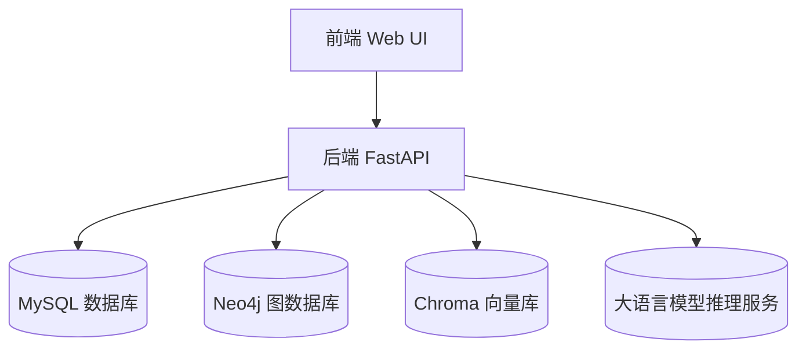
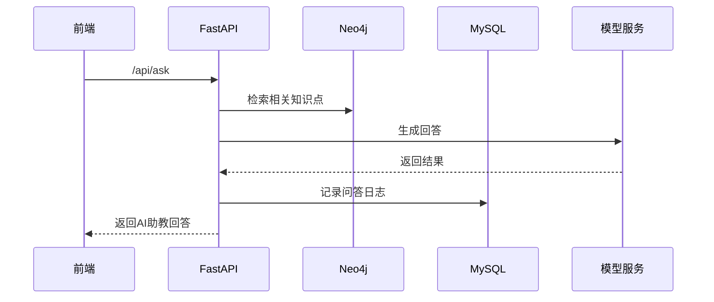

# 详细设计说明书

## 1. 引言

本详细设计说明书用于说明“AI 辅助的个性化学习系统”中各模块的设计细节，包括数据结构、算法流程、接口定义、逻辑流程等。

本手册的预期读者包括系统开发人员、测试人员、维护人员以及项目管理人员。

## 2. 系统的结构

**软件架构分层图**



**接口调用关系**



**可视化与前端展示设计概述**

- **知识图谱展示**：渲染节点关系；
- **学习路径图**：节点颜色表示掌握度；
- **学习统计面板**：展示时间、正确率、推荐列表；
- **AI 助教界面**：对话框式问答窗口。

## 3 模块设计

### 3.1 用户与权限管理模块

1. **模块描述**

   负责用户注册、登录、权限控制与角色分配。系统中存在三类角色：学生、教师、管理员。

2. **功能**

   - 用户注册
   - 用户登录 / JWT 验证
   - 权限控制
   - 用户信息管理

3. **输入项**

   - 用户名、密码
   - 角色（student / teacher / admin）
   - Token（用于权限验证）

4. **输出项**

   - JWT token
   - 用户信息 JSON

5. **设计方法**

   - 使用 JWT 进行无状态认证
   - 密码使用 SHA256 或 bcrypt 加密
   - RBAC（基于角色的权限控制）

6. **流程逻辑**
   
   ```mermaid
   flowchart LR
       A[输入用户名密码] --> B[数据库查找用户]
       B -->|匹配| C[生成JWT Token]
       B -->|不匹配| D[返回登录失败]
       C --> E[返回给前端]
   ```

### 3.2 资源管理与内容解析模块

1. **模块描述**

   负责教师上传课程资源（PDF/PPT/Doc/视频），解析文本，生成可供知识点抽取的结构化内容。

2. **功能**

   - 文件上传
   - 格式识别
   - 文本提取
   - 异常文件处理

3. **输入项**

   - 文件（PDF / PPT / DOCX / 视频字幕等）

4. **输出项**

   - 文本内容（UTF-8）
   - 文件解析日志

5. **设计方法**

   - PDF 用 PyMuPDF
   - DOCX 用 python-docx
   - PPT 用 python-pptx
   - 图片 用 OCR API
   - 视频用 whisper
   - 文本内容按段落拆分
   - 提供错误日志和异常提示

6. **流程逻辑**

   ```mermaid
   flowchart LR
       A[教师上传文件] --> B[识别文件类型]
       B --> C[对应解析器提取文本]
       C --> D[清洗内容]
       D --> E[输出文本并存储]
   ```

### 3.3 知识点抽取模块

1. **模块描述**

   基于 LLM 自动从课程文本中抽取知识点，用于后续图谱构建。

2. **功能**

   - 知识点识别
   - 知识点结构化（名称、定义、属性）
   - 错误知识点过滤

3. **输入项**

   - 课程文本内容

4. **输出项**

   - 知识点 JSON 数组（包含名称、定义、依赖项等）

5. **设计方法**

   - 提示词 + 大语言模型（LLM）
   - 关键词抽取 + 段落语义分析
   - 使用正则与规则过滤无效知识点

   示例 Prompt

   ```
   请从以下文本中抽取关键知识点：
   包括：名称、定义、关键属性、与其他知识点的依赖关系。
   ```

6. **流程逻辑**
   
   ```mermaid
   flowchart LR
       A[输入文本] --> B[分段处理]
       B --> C[调用LLM抽取知识点]
       C --> D[格式化知识点]
       D --> E[保存到数据库]
   ```

### 3.4 知识图谱构建与管理模块

1. **模块描述**

   根据抽取的知识点与关系，构建课程知识图谱，利用 Neo4j 存储。

2. **功能**

   - 图谱创建
   - 节点增删改查
   - 关系增删改查
   - 图谱可视化

3. **输入项**

   - 知识点 JSON
   - 每个知识点之间的依赖关系

4. **输出项**

   - 图数据库中的节点与边
   - 前端可渲染的图 JSON

5. **设计方法**

   - 构建规则：若知识点 B 引用 A → 依赖关系 A → B
   - 使用 Neo4j Cypher 创建节点和关系：

   ```
   CREATE (a:Concept {name: ...})
   CREATE (a)-[:PRECEDES]->(b)
   ```

6. **流程逻辑**

   ```mermaid
   flowchart LR
       A[知识点列表] --> B[识别依赖关系]
       B --> C[构建节点与关系]
       C --> D[写入Neo4j]
       D --> E[图谱可视化]
   ```

### 3.5 向量库管理与检索模块

1. **模块描述**

   构建课程资源的向量索引，实现语义检索。采用二阶段检索策略：先用 embedding 做快速召回（高效、低延迟），再用 reranker（cross-encoder/交叉编码器）对召回候选集精排，从而为 RAG 提供更准确、相关的上下文。

2. **功能**

   - 文本向量化（Embedding）
   - 快速召回（ANN Index）
   - 候选集精排（Reranker / Cross-Encoder）
   - 返回带置信度的 Top-K 片段

3. **输入项**

   - 文本片段（来自资源或知识点）
   - 查询文本（学生提问）

4. **输出项**

   - 精排后的文本片段列表（包含相似度/score）

5. **设计方法**

   - Embedding 模型：BGE / SentenceTransformer（或其他语义向量模型）
   - 向量索引：Chroma / FAISS（Flat 或 HNSW，按性能/内存权衡）
   - Reranker：cross-encoder（如 cross-encoder/ms-marco-* 或自训练的精排模型）
   - 思路：Embedding-index 用于快速召回大候选集（例如 k=100）；Reranker 对候选集做交叉编码评分并返回最终排序（例如取 top 5-10 作为上下文）。

   示例伪代码：

   ```
   # 快速召回 + 精排
   query_emb = embedder.encode(query)
   candidates = index.search(query_emb, k=100)  # 快速召回
   # candidates = [{"id":..., "text":..., "emb":..., "score":...}, ...]
   reranked = reranker.rank(query, [c['text'] for c in candidates])  # cross-encoder 精排
   top_results = reranked[:10]
   ```

   - 性能/准确度权衡：增大召回 k 可以提高召回率但增加 reranker 计算量；可采用批量 rerank 和缓存机制以降低延迟。
   - 工程注意：预计算并缓存文档 embedding；对长文本做分段；对 reranker 使用小型高效模型以控制延迟。

6. **流程逻辑**

   ```mermaid
   flowchart LR
       A[文本分片] --> B["Embedding 预计算并入索引"]
       Q[学生查询] --> C["查询 Embedding"]
       C --> D["ANN 索引快速召回 (k=100)"]
       D --> E["Reranker (cross-encoder) 精排候选集"]
       E --> F["返回 Top-K 片段 给 RAG 模型"]
   ```

### 3.6 RAG 智能问答模块

1. **模块描述**

   结合向量检索的上下文与大模型生成，提供增强型问答。

2. **功能**

   - 问题向量检索
   - Prompt 构造
   - 大模型回答

3. **输入项**

   - 学生问题文本

4. **输出项**

   - AI 生成的回答

5. **设计方法**

   步骤如下：

   ```
   context = Chroma.search(question)
   prompt = combine(question, context)
   answer = LLM.generate(prompt)
   ```

6. **流程逻辑**

   ```mermaid
   flowchart LR
       A[学生提问] --> B[语义向量检索]
       B --> C[构造Prompt]
       C --> D[调用大模型生成回答]
       D --> E[返回结果]
   ```

### 3.7 题库与练习模块

1. **模块描述**

   负责维护题库、学生练习记录。支持选择、填空、编程题。

2. **功能**

   - 题目 CRUD
   - 学生答题记录
   - 错题本管理

3. **输入项**

   - 知识点数据
   - 教师录入的题目
   - 学生答案

4. **输出项**

   - 题目信息
   - 学生成绩记录

5. **设计方法**

6. **流程逻辑**

   ```mermaid
   flowchart LR
       A[选择知识点] --> B[教师录入]
       B --> C[题库存储]
       C --> D[学生答题]
       D --> E[记录成绩]
   ```

### 3.8 学习分析与学习路径推荐模块

1. **模块描述**

   分析学生的学习记录，并结合知识图谱提供个性化学习路径。

2. **功能**

   - 学生掌握度分析
   - 基于图谱的路径推荐
   - 学习报告生成

3. **输入项**

   - 学生答题记录
   - 学习行为数据
   - 知识图谱结构

4. **输出项**

   - 学习路径（知识节点列表）
   - 掌握度评分
   - 学习报告

5. **设计方法**

   **计算掌握度**

   ```
   score = correct / total
   ```

   **推荐路径**

   - 知识图谱拓扑排序
   - 按学生薄弱节点优先建议

6. **流程逻辑**
   
   ```mermaid
   flowchart LR
       A[收集学习数据] --> B[计算掌握度]
       B --> C[识别薄弱点]
       C --> D[基于图谱生成学习路径]
       D --> E[展示给学生]
   ```

### 3.9 系统管理后台模块

1. **模块描述**

   用于维护全系统数据和配置，包括用户管理、数据备份、服务监控等。

2. **功能**

   - 监控系统运行状态
   - 数据库备份与恢复
   - 用户管理
   - 模块配置

3. **输入项**

   - 管理命令
   - 配置项

4. **输出项**

   - 备份文件
   - 系统日志
   - 配置结果

5. **设计方法**

   - 定时任务进行备份
   - 日志系统：按模块分类，自动收集错误

6. **流程逻辑**
   
   ```mermaid
   flowchart LR
       A[管理员操作] --> B[触发系统接口]
       B --> C[执行配置/备份]
       C --> D[输出日志或执行结果]
   ```

## 数据库设计

[数据库设计](./数据库设计.md)

## 接口设计

[aicourse 在线接口文档](https://nz0hmoqmlc.apifox.cn/)
[API](./api.md)