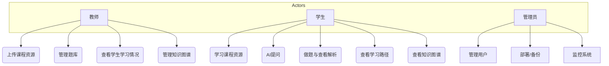
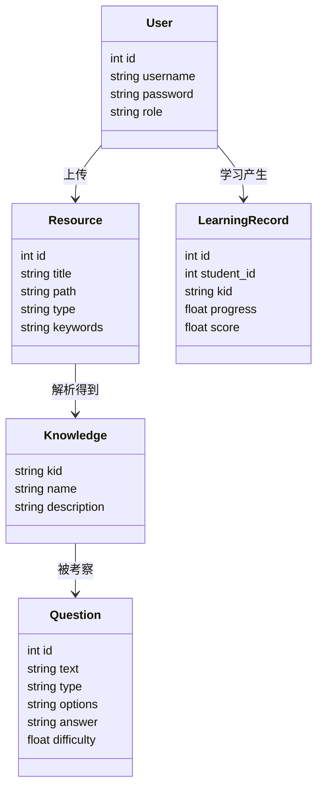
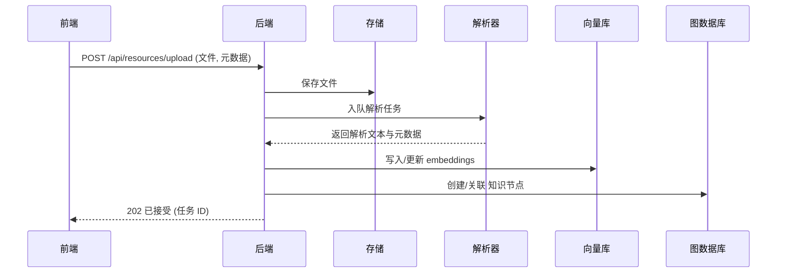
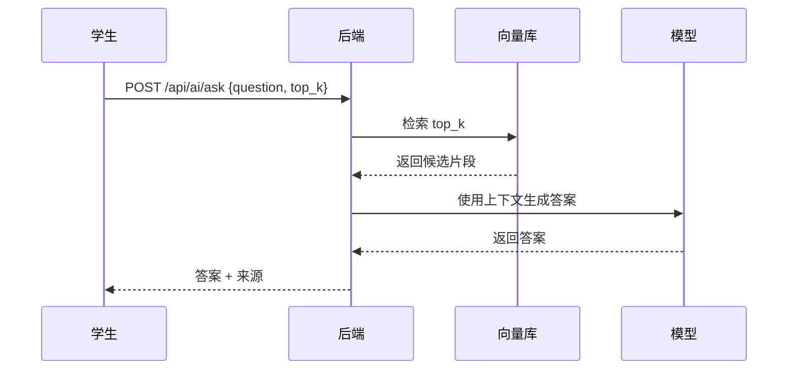
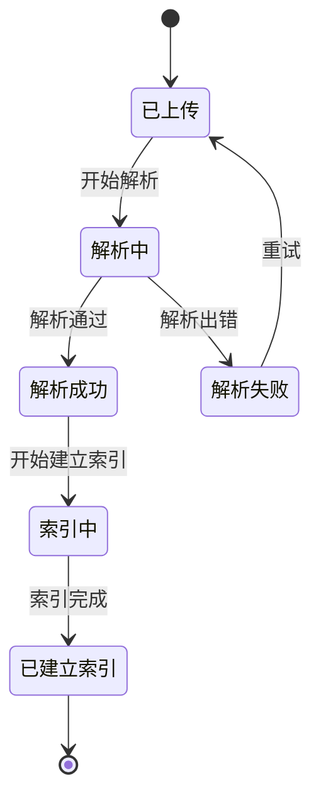
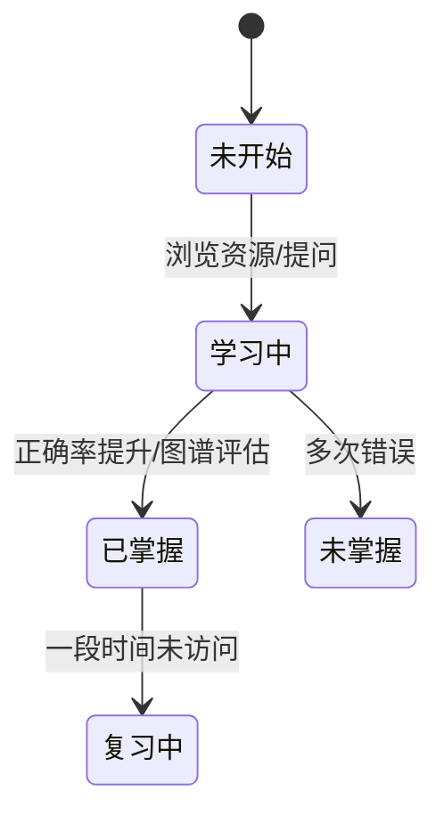

# 软件需求规格说明书（SRS）

## 1．问题陈述

随着课程教学资源多样化，教师与学生需要一个便捷的系统来管理多模态教学资源、构建课程知识图谱、并提供基于知识库的检索增强问答 (RAG) 与个性化学习路径服务。

当前问题包括：

- 教学资源分散，元数据缺失，检索困难；
- 课程知识点与资源间关联不明确，无法形成可视化知识图谱；
- 学生学习路径缺乏个性化推荐与短板诊断；
- AI 问答效果受限于检索质量与知识库覆盖。

本系统目标：提供一套面向高校课程的原型系统，实现资源上传解析、知识图谱构建、向量检索与 RAG 问答、题库与学习路径推荐、基本权限管理与可视化展示，供教学与演示使用。

主要功能场景（举例）：

- 教师上传 PPT/PDF/视频 → 系统解析提取章节/标题/关键词 → 建入知识库并与知识图谱节点关联；
- 学生提问 → 系统检索相关文档片段并结合微调模型生成答案 → 返回答案并标注来源；
- 学生做题 → 系统记录答题结果并更新知识点掌握度 → 推荐补强资源与下一学习节点。
- 教师查看学生情，包括学生学习掌握度、题目正确率图表、学习路径建议。

**系统特征**  
本系统为在线交互式 Web 系统，所有查询均可实时完成。  
主要包括教师端、学生端及后台管理端。

## 2．系统划分

系统由以下子系统组成：

- 前端子系统（教师/学生/管理员界面）
- 后端服务（API 网关、业务逻辑）
- 数据存储层（MySQL、文件存储）
- 知识图谱服务（Neo4j）
- 向量检索服务（Chroma/FAISS 本地或远端）
- 模型服务（微调模型或外部模型 API）
- 任务调度/异步处理（文件解析、索引构建）

系统边界：

- 包含：资源管理、知识图谱、向量检索、RAG、题库、学习路径推荐与可视化；
- 不包含：企业级多租户、商用 SLA、安全审计（可作为后续扩展）。

## 3．子系统功能（用例图）

主要用例：教师上传资源、查看/编辑资源、构建/修正知识点；学生提问、做题、查看学习路径；管理员管理用户与系统配置。

功能描述（简要）：

- 上传资源：支持多模态文件上传、元数据填写、异步解析与入库；
- 提问：接收用户问题、检索上下文、拼接增强提示并调用模型生成答案；
- 做练习：获取题目、提交答案、记录成绩并更新知识点掌握度；
- 管理知识图谱：显示图谱，支持节点展开、资源链接与搜索。

## 4．数据结构（类图）

系统主要实体（类）：User、Resource、KnowledgeNode、Relation、Question、Answer、Exercise、Attempt、Embedding、ModelMetadata

数据持久化：

- 关系数据与元数据存储在 MySQL；
- 知识图谱以 Neo4j 存储节点/关系并同步必要元数据；
- 向量索引与 embeddings 存储在本地 Chroma/FAISS 或外部向量库。

## 5．系统操作分析（Sequence）

示例 1：资源上传并解析入库

示例 2：RAG 问答流程

## 6．系统状态分析（State Transition）

以资源对象 Resource 的状态机为例：

掌握度更新示例

作业/练习 Attempt 状态：submitted -> graded -> reviewed（可选）

## 7．系统界面与屏幕设计（主菜单、关键页面）

主要页面（关键元素说明）：

- 登录页：用户名/密码、忘记密码链接
- 仪表盘（教师/学生差异化）：展示统计、最新资源、待处理任务
- 资源管理：上传按钮、资源列表、解析状态、下载/删除
- 知识图谱可视化：图谱画布、节点详情侧栏、搜索框
- AI 问答：问题输入框、返回答案、显示来源片段
- 题库与练习：题目列表、答题界面、历史成绩

界面样式与响应：

- 桌面优先，采用响应式布局；
- 表单均需校验输入长度与文件类型；
- 异步操作需显示任务状态与提示。

示例：资源管理屏幕要素列表

- 文件上传区域（拖拽/点击）
- 元数据编辑（标题、章节、关键词）
- 解析状态（Waiting/Parsing/Parsed/Failed）
- 链接到知识图谱节点

## 8．系统输出设计（报表、导出、日志）

## 8.1 学生学习报告

示例表：

| 字段         | 内容            |
| ------------ | --------------- |
| 学生姓名     | XXX             |
| 总学习时间   | 10 小时         |
| 掌握度       | 78%             |
| 关键知识点   | 列表呈现        |
| 推荐学习资源 | 文件名列表      |
| 错误题目统计 | 题号 + 错误原因 |

## 8.2 题目统计报表

- 按知识点统计正确率
- 按章节统计掌握度
- 题目难度分布

## 8.3 AI 问答记录表

- 提问时间
- 提问内容
- AI 回答
- 涉及知识点

## 9．系统性能设计（备份、恢复、安装、性能指标）

可靠性与备份：

- 定期备份 MySQL 数据库与 Neo4j 数据卷；
- 向量索引与模型文件需同步备份（外部存储或定期拷贝）。

性能目标（示例）：

- AI 问答（RAG）在演示数据规模下响应时间：多数请求 < 3s；检索子环节 < 1s；生成视模型而定。
- 并发能力：演示环境支持 10-20 并发用户；非生产不做高并发保证。

部署与安装：

- 使用 Docker Compose 提供一键部署示例（包含 MySQL、Neo4j、后端、前端）；
- 开发模式支持本地运行（虚拟环境 + 本地数据库或容器化 DB）。

安全与合规：

- 不在仓库中提交敏感凭证，使用 `.env` 存放配置；
- 基本输入校验与文件类型检查，防止注入与上传木马文件。

## 附录 A：术语表

- RAG：Retrieval-Augmented Generation
- LLM：Large Language Model（大语言模型）
- KG：Knowledge Graph（知识图谱）
- MVP：Minimum Viable Product（最小可行产品）
