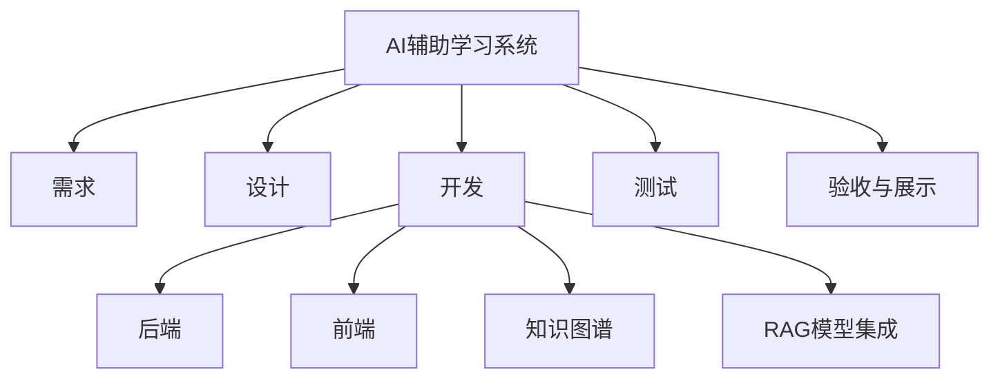

# 项目计划

文件状态：

- [ ] 草稿
- [x] 正式发布
- [ ] 正在修改

|            |                         |
| ---------- | ----------------------- |
| 文件标识： | Company-Project-PP-PLAN |
| 当前版本： | 1.0                     |
| 作 者：    | 郭彦晨                  |
| 完成日期： | 2025-09-25              |

[TOC]

## 0. 文档介绍

### 0.1 文档目的

本项目计划书用于明确 AI 辅助个性化学习系统（以下简称“系统”）开发与交付的目标、范围、过程、人员分工、资源需求、进度安排、风险与应对措施，为项目实施、监控、验收与移交提供依据。

### 0.2 文档范围

**本文档涵盖**：项目背景与目标，开发过程与方法，人力资源分配，软硬件资源，财务与成本估计，任务进度安排，下属计划说明

**不包含**：系统详细需求规格说明（SRS），系统概要与详细设计，技术实现代码与用户手册

### 0.3 读者对象

- 课程导师
- 项目开发团队成员
- 质量保障人员
- 其他参与或关注本项目的人员

### 0.4 参考文献

[项目：AI 辅助的学习系统] 《项目：AI 辅助的学习系统》, 2025
[SPP-PROC-PP] SEPG，《项目规划规范》，2022  
[GQM] Basili, Goal Question Metric Paradigm, University of Maryland, 1994

### 0.5 术语与缩写解释

| 术语/缩写 | 解释                                         |
| --------- | -------------------------------------------- |
| SPP       | 精简并行过程（Simplified Parallel Process）  |
| PP        | 项目规划（Project Planning）                 |
| RAG       | 检索增强生成：Retrieval-Augmented Generation |
| LLM       | 大语言模型（Large Language Model）           |
| KG        | 知识图谱（Knowledge Graph）                  |
| WBS       | 工作分解结构（Work Breakdown Structure）     |

## 1. 项目介绍

### 1.1 项目范围

本项目是一个面向大学课程学习场景的 **AI 辅助学习系统**，其核心功能包括：

- 教师上传教学资源（PDF/PPT/视频）并自动解析知识点；
- 自动构建课程知识图谱；
- 基于 RAG 的智能问答；
- 题库管理与自动关联知识点；
- 学生学习过程跟踪与掌握度评估；
- 个性化学习路径推荐；
- 学习图谱可视化展示。

**包含的内容：**

- 基本 Web 系统前后端
- 基于向量检索与 LLM 的 AI 问答
- 知识图谱生成与可视化
- 学习路径推荐算法（简化版本）
- 题库管理与测评功能

**不包含的内容：**

- 商业级权限体系
- 大规模并发支持
- 复杂的课程资源库
- 大规模数据安全与隐私管理

**适用领域：**

- 教育科技原型系统
- 软件工程课程作业
- 小型或中型学习辅助项目原型

**不适用领域：**

- 商业化在线教育平台
- 对数据安全高度敏感的行业

### 1.2 项目目标

- 在学期内（12 周）交付可演示的系统原型（MVP），包含资源上传、知识图谱导入与可视化、RAG 问答接口与基础学习路径推荐功能；
- 提供部署手册、测试报告与演示数据集；
- 目标可验证性指标：主要 API 在演示数据集下响应时间交互类 < 3s，检索类 < 1s；知识图谱与题库功能可完成端到端演示；微调实验产出可复现训练脚本。

### 1.3 客户与最终用户介绍

**客户（课程方）：**  
软件工程课程组、指导教师

**最终用户：**

- 教师：资源上传、题库管理、查看学生图谱、学习评估
- 学生：浏览知识点、AI 问答、练习题、查看学习路径

### 1.4 开发方介绍

- 开发方：校内学生项目组（成员见人员分工）。
- 责任人（项目经理）：郭彦晨（总体协调、文档与关键模块负责）。

### 1.5 制约

- 标准与规范：遵循学校项目管理规范、开源组件许可（Apache/MIT 等）、代码托管与版本控制规范（GitHub）；对外接口遵循 REST 或 OpenAPI 规范。
- 影响因素：可用算力（GPU）、网络对外资源访问（模型权重、容器镜像）、第三方服务限制。
- 假设与依赖：假设项目组可访问必要模型权重与数据样本；依赖 Docker、Neo4j 与向量库可在开发环境中部署并运行。

## 2. 项目过程定义

### 2.1 过程模型

采用裁剪的敏捷迭代过程（基于 SPP 思路）—— 短周期 Sprint（每周一次评审）：需求确认 → 迭代计划 → 开发实现 → 单元/集成测试 → 迭代评审。关键里程碑在第 4、7、10 周进行阶段评审。

特性：

- 文档开发与编码并行
- 模型调试与前后端开发可并行

### 2.2 方法与工具

| 过程域       | 方法与工具                                                     |
| ------------ | -------------------------------------------------------------- |
| 需求与设计   | 文档（Markdown）、Figma 或原型工具、用例与 API 设计（OpenAPI） |
| 开发         | Python(FastAPI)、Node/Vue、PyTorch、transformers、PEFT/LoRA    |
| 数据库       | MySQL、Neo4j、Chroma                                           |
| 版本管理     | Git + GitHub（Issues、Projects）                               |
| 容器化与部署 | Docker、docker-compose                                         |
| 测试         | pytest、httpx、Postman                                         |
| CI/CD        | GitHub Actions                                                 |

## 3. 人力资源计划

### 3.1 角色分配表

| 角色       |                     职责 | 指定人员     | 说明                      |
| ---------- | -----------------------: | ------------ | ------------------------- |
| 机构领导   |           项目支持与验收 | 指导教师     | 提供资源与验收标准        |
| 项目经理   | 项目统筹、进度与风险管理 | 郭彦晨       | 兼任资源解析模块负责人    |
| 需求分析员 |       需求收集、用例定义 | 全体成员轮流 | 输出需求文档              |
| 系统设计员 |            概要/详细设计 | 张诏、冯轶开 | 负责数据库与接口设计      |
| 程序员     |                 功能开发 | 全体成员     | 前后端与模型实现          |
| 测试员     |     测试用例、自动化测试 | 指定测试成员 | 负责单元、集成测试        |
| 质量保证员 |       代码评审、标准遵从 | 全体成员轮值 | 负责代码检查              |
| 配置管理员 |           版本与部署配置 | 郭彦晨       | Docker Compose 与部署脚本 |

### 3.2 资源投入估算（人日）

- 需求与设计：约 10 人日
- 核心功能开发：约 60 人日
- 测试与集成：约 15 人日
- 文档与演示准备：约 5 人日

## 4. 软硬件资源计划

| 软/硬件名称   | 级别 | 详细配置                 | 获取方式与时间             | 使用说明                             |
| ------------- | ---- | ------------------------ | -------------------------- | ------------------------------------ |
| 开发电脑      | 普通 | Intel i5/16GB/500GB      | 已有                       | 团队成员日常开发与测试使用           |
| 训练 GPU      | 关键 | NVIDIA GPU 8GB+ 或云 GPU | 云租用（按需）             | 模型微调、加速实验（负责人提前申请） |
| Neo4j         | 关键 | Neo4j 5.x 容器           | 本地部署（docker-compose） | 知识图谱存储与可视化服务             |
| MySQL         | 普通 | MySQL 8 容器             | docker-compose             | 业务数据存储                         |
| 向量库 Chroma | 关键 | 本地/容器化部署          | 本地部署                   | 向量检索服务                         |
| Docker 环境   | 普通 | Docker Desktop           | 已有/安装                  | 容器化运行所有服务                   |

## 5. 财务计划

> 注：以下为估算

| 开支类别   | 主要开支项、用途   |  估算金额（示例） | 时间           |
| ---------- | ------------------ | ----------------: | -------------- |
| 基础设施   | 云 GPU 租用        |       ￥ 100 / 月 | 视训练需求而定 |
| 存储       | 模型权重与数据备份 |        ￥ 10 / 月 | 持续           |
| 第三方服务 | 付费 API（可选）   | ￥ 0 - ￥ 50 / 月 | 按需           |
| 其他       | 域名/文档托管      |      ￥ 0 - ￥ 50 | 一次性         |

## 6. 任务与进度

| 任务名称             | 起止时间（周） | 负责人       | 工作量（人日） | 预期成果                     |
| -------------------- | -------------: | ------------ | -------------: | ---------------------------- |
| 需求确认与数据准备   |            1-2 | 全体         |              6 | 需求文档、样例数据           |
| 系统与数据库设计     |              3 | 张诏、冯轶开 |              6 | 概要设计、数据库模型         |
| 前端基础与上传页面   |            3-4 | 冯轶开       |              8 | 上传页面原型                 |
| 后端框架与 API       |            3-5 | 龙功泽       |             10 | 基础 API（用户、资源）       |
| 资源解析实现         |            5-7 | 郭彦晨       |             12 | 文档解析、OCR、向量化脚本    |
| 知识图谱导入与可视化 |            6-8 | 张诏         |             10 | Neo4j 导入脚本与可视化页面   |
| 向量检索与 RAG 集成  |            8-9 | 郭彦晨       |             12 | RAG pipeline 与检索服务      |
| 微调实验（LoRA）     |           8-10 | 郭彦晨       |             10 | 可复现训练脚本与少量模型权重 |
| 集成测试与修复       |             10 | 全体         |              8 | 集成测试报告、BUG 修复       |
| 演示准备与文档       |             11 | 全体         |              6 | 演示脚本、部署手册           |
| 验收与总结           |             12 | 全体         |              4 | 验收报告与总结文档           |

## 7. 下属计划

| 下属计划名称       | 建议负责人           | 预计产生时间 |
| ------------------ | -------------------- | -----------: |
| 配置管理计划       | 配置管理员（郭彦晨） |       周 2-3 |
| 质量保证计划       | 质量保证员（轮值）   |         周 3 |
| 技术评审计划       | 系统设计员           |         周 4 |
| 测试计划           | 测试负责人           |         周 6 |
| 部署计划（Docker） | 部署负责人（郭彦晨） |       周 5-6 |
| 数据准备与标注计划 | 数据负责人（张诏）   |       周 1-3 |

---

# 附录 A 项目估计

## A.1 WBS

## A.2 规模估计

| 模块     | 估算规模     |
| -------- | ------------ |
| 前端     | 12000 行代码 |
| 后端     | 5000 行代码  |
| 图谱节点 | 150–250      |
| 测试用例 | 40 条        |

## A.3 工作量估计

总工作量约：**960 人时**

## A.4 成本估计

人力成本（960 × 30 元）= **28800 元**  
总成本 ≈ **29000 元**（含资源）
